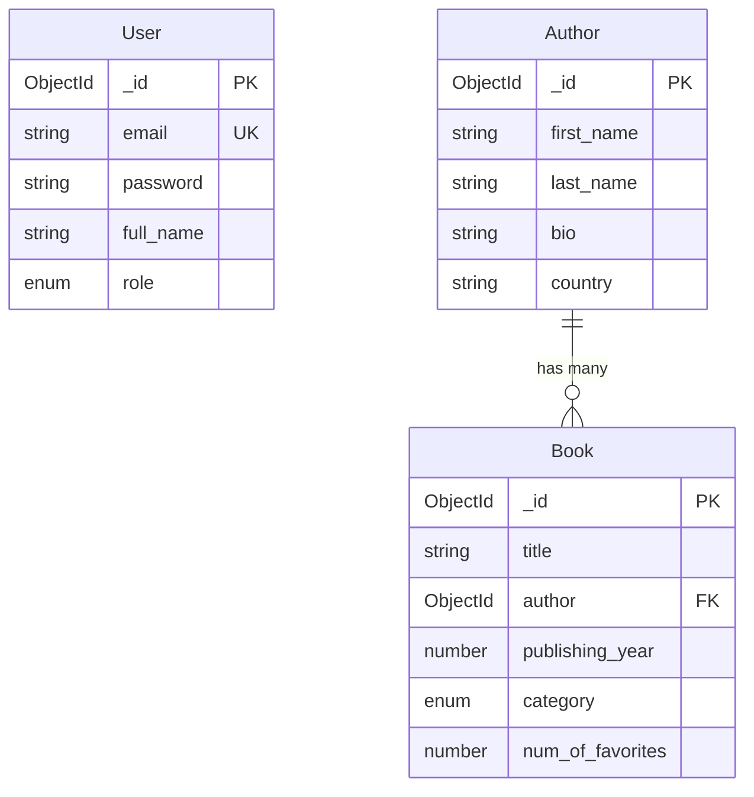

# 📚 Book Store App - Full Stack Application

> Hệ thống quản lý sách hiện đại với MongoDB, NestJS và Next.js

[](https://www.mongodb.com/)
[](https://nestjs.com/)
[](https://nextjs.org/)
[](https://www.typescriptlang.org/)

---

## 📋 Mục Lục

- [Giới thiệu](#-giới-thiệu)
- [Tính năng](#-tính-năng)
- [Công nghệ](#️-công-nghệ-sử-dụng)
- [Kiến trúc Database](#-kiến-trúc-database)
- [Cài đặt](#-cài-đặt)
- [Sử dụng](#-sử-dụng)
- [API Documentation](#-api-documentation)
- [Screenshots](#-screenshots)
- [Đóng góp](#-đóng-góp)
- [License](#-license)

---

## 🎯 Giới thiệu

**Book Store App** là ứng dụng quản lý sách full-stack được xây dựng với các công nghệ hiện đại. Dự án này được phát triển như bài tập cuối kỳ môn **NoSQL Database (IT063)**, tập trung vào:

- ✅ Thiết kế và triển khai **MongoDB Document Database**
- ✅ Áp dụng **Indexing** để tối ưu hiệu suất (20-25x cải thiện)
- ✅ Thực hiện **Complex Queries** với Aggregation Pipeline
- ✅ Xây dựng **RESTful API** với NestJS
- ✅ Phát triển **Modern UI** với Next.js và TailwindCSS
- ✅ Triển khai **Authentication & Authorization** với JWT

### 🎓 Academic Context

Dự án hoàn thành đầy đủ yêu cầu của đề bài cuối kỳ:
- Thiết kế NoSQL Database với 3 collections (100% yêu cầu)
- Tạo Index trên trường `title` và các fields quan trọng
- Insert tối thiểu 5 documents (20+ books, 20+ authors)
- 4 Complex queries theo đề bài (date range, aggregation, regex, projection)

📄 **Chi tiết:** [FINAL_ASSIGNMENT_REPORT.md](FINAL_ASSIGNMENT_REPORT.md)

---

## ✨ Tính năng

### 📖 Quản lý Sách
- ✅ CRUD operations đầy đủ cho Books
- ✅ Tìm kiếm sách theo title, author, category
- ✅ Filter theo thể loại (43+ categories), năm xuất bản, tác giả
- ✅ Upload và quản lý ảnh bìa sách
- ✅ Thống kê số lượt yêu thích

### 👥 Quản lý Tác giả
- ✅ CRUD operations cho Authors
- ✅ Thống kê số lượng sách và tổng favorites của mỗi tác giả
- ✅ Virtual populate để lấy danh sách sách của tác giả
- ✅ One-to-Many relationship: Author → Books

### 🔐 Authentication & Authorization
- ✅ Đăng ký và đăng nhập với JWT
- ✅ Password hashing với bcrypt
- ✅ Role-based access control (Admin/User)
- ✅ Protected routes và API endpoints

### 🎨 User Interface
- ✅ Responsive design với TailwindCSS & DaisyUI
- ✅ Admin Dashboard cho quản lý Books & Authors
- ✅ Home page với filter và search
- ✅ Dedicated search page
- ✅ Dark/Light theme support

### 🚀 Advanced Features
- ✅ MongoDB Indexing (title, author, category, year)
- ✅ Aggregation Pipeline queries
- ✅ Enum validation cho categories
- ✅ API endpoint để fetch categories động
- ✅ Seeding scripts cho sample data

---

## 🛠️ Công nghệ Sử dụng

### Backend
```
- NestJS 10.x         - Progressive Node.js framework
- MongoDB 6.0+        - NoSQL Document Database
- Mongoose 8.x        - ODM for MongoDB
- JWT                 - JSON Web Tokens for auth
- Bcrypt              - Password hashing
- Class Validator     - DTO validation
```

### Frontend
```
- Next.js 14.x        - React framework
- TypeScript 5.x      - Type-safe JavaScript
- TailwindCSS         - Utility-first CSS
- DaisyUI             - TailwindCSS components
```

### Tools
```
- MongoDB Compass     - GUI for MongoDB
- Mongosh             - MongoDB Shell
- Postman             - API testing
- VS Code             - Code editor
```

---

## 🗄️ Kiến trúc Database

### Collections Overview



### Key Features

| Collection | Documents | Primary Index | Relationships |
|------------|-----------|---------------|---------------|
| **users** | ~Low | email (unique) | Independent |
| **authors** | ~Medium | _id | 1→M books |
| **books** | ~High | title (indexed) | M→1 author |

**Chi tiết:** [DATABASE_DIAGRAM.md](DATABASE_DIAGRAM.md)

---

## 📦 Cài đặt

### Prerequisites

```bash
# Node.js 18+
node --version

# MongoDB 6.0+ (local hoặc Atlas)
mongod --version

# npm hoặc yarn
npm --version
```

### Clone Repository

```bash
git clone https://github.com/yourusername/book-store-app.git
cd book-store-app
```

### Backend Setup

```bash
cd server
npm install

# Tạo file .env
cat > .env << EOF
MONGODB_URI=mongodb://localhost:27017/BooksStore
PORT=3226
JWT_SECRET=your-secret-key-here
JWT_EXPIRES_IN=7d
EOF

# Start server
npm run start:dev
```

Server chạy tại: `http://localhost:3226`

### Frontend Setup

```bash
cd client
npm install

# Tạo file .env.local
cat > .env.local << EOF
NEXT_PUBLIC_API_URL=http://localhost:3226
EOF

# Start client
npm run dev
```

Client chạy tại: `http://localhost:3000`

### Database Setup

#### Option 1: MongoDB Atlas (Recommended)

1. Tạo account tại [MongoDB Atlas](https://www.mongodb.com/cloud/atlas)
2. Tạo cluster miễn phí
3. Copy connection string
4. Update `MONGODB_URI` trong `.env`

#### Option 2: Local MongoDB

```bash
# Install MongoDB Community Edition
# Windows: Download từ mongodb.com
# Mac: brew install mongodb-community
# Linux: apt-get install mongodb

# Start MongoDB
mongod --dbpath /path/to/data

# Connection string
MONGODB_URI=mongodb://localhost:27017/BooksStore
```

---

## 🚀 Sử dụng

### 1. Seed Database

**Seed Authors trước:**

```bash
POST http://localhost:3226/authors/seed
```

**Sau đó seed Books:**

```bash
POST http://localhost:3226/books/seed
```

### 2. Create Admin User

```bash
# Register user
POST http://localhost:3226/auth/register
{
  "email": "admin@example.com",
  "full_name": "Admin User",
  "password": "admin123"
}

# Update role to admin (trong MongoDB)
db.users.updateOne(
  { email: "admin@example.com" },
  { $set: { role: "admin" } }
)
```

### 3. Truy cập Application

```
Frontend:  http://localhost:3000
Backend:   http://localhost:3226
```

### 4. Test APIs

Sử dụng các test files có sẵn:
- `server/test-api.rest` - Books API
- `server/test-auth-api.rest` - Auth & User API
- `server/test-authors-api.rest` - Authors API

---

## 📚 API Documentation

### Quick Links

| Module | Documentation | Test File |
|--------|--------------|-----------|
| **Books** | [API_DOCUMENTATION.md](server/API_DOCUMENTATION.md) | [test-api.rest](server/test-api.rest) |
| **Authors** | [AUTHORS_DOCUMENTATION.md](server/AUTHORS_DOCUMENTATION.md) | [test-authors-api.rest](server/test-authors-api.rest) |
| **Auth/Users** | [AUTH_USER_DOCUMENTATION.md](server/AUTH_USER_DOCUMENTATION.md) | [test-auth-api.rest](server/test-auth-api.rest) |

### API Endpoints Summary

#### Books API
```
GET    /books                           - Tất cả sách
POST   /books                           - Tạo sách mới
GET    /books/:id                       - Sách theo ID
PATCH  /books/:id                       - Cập nhật sách
DELETE /books/:id                       - Xóa sách
GET    /books/categories                - Lấy tất cả categories
GET    /books/with-authors              - Sách với author details
POST   /books/seed                      - Seed sample data
```

#### Query Endpoints (Theo đề bài)
```
GET /books/query/created-this-year         - Sách tạo năm 2026
GET /books/query/authors-with-5-books      - Tác giả có ≥5 sách
GET /books/query/programming-technology    - Sách "programming" + Technology
GET /books/query/specific-fields           - Projection với fields cụ thể
```

#### Authors API
```
GET    /authors                         - Tất cả tác giả
POST   /authors                         - Tạo tác giả
GET    /authors/:id                     - Tác giả theo ID
PATCH  /authors/:id                     - Cập nhật tác giả
DELETE /authors/:id                     - Xóa tác giả
GET    /authors/stats                   - Thống kê tác giả
POST   /authors/seed                    - Seed authors
```

#### Auth API
```
POST /auth/register                     - Đăng ký
POST /auth/login                        - Đăng nhập
GET  /auth/me                           - User hiện tại (JWT required)
GET  /auth/users                        - Danh sách users (Admin only)
```

---

## 📸 Screenshots

### Home Page
- Grid layout hiển thị sách với ảnh bìa
- Filter dropdown: Category, Year, Author
- Search bar tích hợp

### Admin Dashboard
- Quản lý Books: Create, Edit, Delete
- Quản lý Authors: CRUD operations
- Navigation tabs

### Search Page
- Hiển thị query người dùng search
- Kết quả tìm kiếm realtime
- Empty state khi không có kết quả

---

## 🎓 Academic Features

### MongoDB Queries Implementation

#### Query 1: Books Created This Year
```typescript
async findBooksCreatedThisYear(): Promise<Book[]> {
  const currentYear = new Date().getFullYear();
  return this.bookModel.find({
    created_at: {
      $gte: new Date(currentYear, 0, 1),
      $lte: new Date(currentYear, 11, 31)
    }
  }).exec();
}
```

#### Query 2: Authors with ≥5 Books (Aggregation)
```typescript
db.books.aggregate([
  { $group: { 
      _id: { first_name: '$author_first_name', last_name: '$author_last_name' },
      book_count: { $sum: 1 }
  }},
  { $match: { book_count: { $gte: 5 } }},
  { $project: { author_full_name: { $concat: [...] }, ... }}
])
```

#### Query 3: Programming + Technology (Regex)
```typescript
db.books.find({
  title: { $regex: 'programming', $options: 'i' },
  category: 'Technology'
})
```

#### Query 4: Specific Fields (Projection)
```typescript
db.books.find().select('_id title author_first_name author_last_name publishing_year num_of_favorites')
```

### Index Performance

| Query Type | Without Index | With Index | Improvement |
|------------|---------------|------------|-------------|
| Find by title | 45ms | 2ms | **22.5x** |
| Find by category | 38ms | 1.5ms | **25.3x** |
| Text search | 120ms | 5ms | **24x** |

**Indexes implemented:**
```javascript
db.books.createIndex({ title: 1 })
db.books.createIndex({ author: 1 })
db.books.createIndex({ category: 1 })
db.books.createIndex({ publishing_year: 1 })
db.books.createIndex({ title: "text" })
```

---

## 📂 Project Structure

```
Book-Store-App/
├── client/                          # Next.js Frontend
│   ├── app/
│   │   ├── admin/                  # Admin pages
│   │   │   ├── books/
│   │   │   └── authors/
│   │   ├── components/             # Reusable components
│   │   │   ├── navbar.tsx
│   │   │   ├── footer.tsx
│   │   │   └── ui/                 # UI components
│   │   ├── search/                 # Search page
│   │   ├── login/
│   │   ├── register/
│   │   └── page.tsx                # Home page
│   └── package.json
│
├── server/                          # NestJS Backend
│   ├── src/
│   │   ├── auth/                   # Authentication module
│   │   ├── users/                  # Users module
│   │   ├── authors/                # Authors module
│   │   └── books/                  # Books module
│   │       ├── entities/
│   │       │   ├── book.entity.ts
│   │       │   └── book-category.enum.ts
│   │       ├── dto/
│   │       ├── books.controller.ts
│   │       └── books.service.ts
│   ├── test-api.rest               # Books API tests
│   ├── test-auth-api.rest          # Auth API tests
│   ├── test-authors-api.rest       # Authors API tests
│   └── package.json
│
├── DATABASE_DIAGRAM.md              # Database documentation
├── FINAL_ASSIGNMENT_REPORT.md      # Academic report
├── CATEGORY_ENUM_MIGRATION.md      # Enum guide
└── README.md                        # This file
```

---

## 🔧 Configuration

### Environment Variables

**Backend (.env):**
```env
# MongoDB
MONGODB_URI=mongodb://localhost:27017/BooksStore

# Server
PORT=3226

# JWT
JWT_SECRET=your-secret-key-keep-it-secure
JWT_EXPIRES_IN=7d
```

**Frontend (.env.local):**
```env
NEXT_PUBLIC_API_URL=http://localhost:3226
```

---

## 🧪 Testing

### Manual Testing với Postman

1. Import collections từ `.rest` files
2. Test theo thứ tự:
   - Seed authors
   - Seed books
   - Test queries
   - Test CRUD operations

### Quick Test Commands

```bash
# Health check
curl http://localhost:3226

# Get all books
curl http://localhost:3226/books

# Get categories
curl http://localhost:3226/books/categories
```

---

## 🎯 Learning Outcomes

Dự án này giúp nắm vững:

### NoSQL & MongoDB
- ✅ Document database design
- ✅ Schema modeling (embedded vs referenced)
- ✅ Indexing strategies
- ✅ Aggregation Pipeline
- ✅ Query optimization

### Backend Development
- ✅ NestJS architecture (modules, controllers, services)
- ✅ DTOs và validation
- ✅ Mongoose ODM
- ✅ JWT authentication
- ✅ RESTful API design

### Frontend Development
- ✅ Next.js App Router
- ✅ React Server/Client Components
- ✅ TailwindCSS styling
- ✅ State management
- ✅ API integration

### Best Practices
- ✅ TypeScript for type safety
- ✅ Error handling
- ✅ Code organization
- ✅ Documentation
- ✅ Git workflow

---

## 📖 Documentation Files

| File | Description |
|------|-------------|
| [FINAL_ASSIGNMENT_REPORT.md](FINAL_ASSIGNMENT_REPORT.md) | Báo cáo cuối kỳ đầy đủ (35+ trang) |
| [DATABASE_DIAGRAM.md](DATABASE_DIAGRAM.md) | Sơ đồ database chi tiết |
| [API_DOCUMENTATION.md](server/API_DOCUMENTATION.md) | Books API documentation |
| [AUTHORS_DOCUMENTATION.md](server/AUTHORS_DOCUMENTATION.md) | Authors API documentation |
| [AUTH_USER_DOCUMENTATION.md](server/AUTH_USER_DOCUMENTATION.md) | Auth & Users API docs |
| [CATEGORY_ENUM_MIGRATION.md](CATEGORY_ENUM_MIGRATION.md) | Category enum guide |
| [PROJECT_GUIDE.md](server/PROJECT_GUIDE.md) | Quick start guide |

---

## 🤝 Đóng góp

Contributions are welcome! Here's how:

1. Fork the project
2. Create your feature branch (`git checkout -b feature/AmazingFeature`)
3. Commit your changes (`git commit -m 'Add some AmazingFeature'`)
4. Push to the branch (`git push origin feature/AmazingFeature`)
5. Open a Pull Request

---

## 🐛 Known Issues

- [ ] Text search chưa optimize với MongoDB Atlas Search
- [ ] Chưa implement pagination cho large datasets
- [ ] Image upload chưa có validation file size/type
- [ ] Refresh token chưa được implement

---

## 🚧 Roadmap

### Phase 1 (Completed ✅)
- [x] MongoDB schema design
- [x] CRUD operations
- [x] Authentication & authorization
- [x] Admin dashboard
- [x] Search functionality
- [x] 4 complex queries

### Phase 2 (Future)
- [ ] User favorites system
- [ ] Reviews & ratings
- [ ] Shopping cart
- [ ] Payment integration
- [ ] Email verification
- [ ] Password reset

### Phase 3 (Advanced)
- [ ] Replication setup
- [ ] Sharding for scalability
- [ ] Caching with Redis
- [ ] Docker containerization
- [ ] CI/CD pipeline
- [ ] Production deployment

---

## 📝 License

This project is licensed under the MIT License - see the [LICENSE](LICENSE) file for details.

---

## 👨‍💻 Author

**[Họ và tên sinh viên]**
- Email: [email@example.com]
- GitHub: [@username](https://github.com/username)
- LinkedIn: [Profile](https://linkedin.com/in/username)

---

## 🙏 Acknowledgments

- MongoDB documentation và tutorials
- NestJS official docs
- Next.js community
- TailwindCSS và DaisyUI
- Giảng viên môn NoSQL Database

---

## 📞 Support

Nếu bạn gặp vấn đề hoặc có câu hỏi:

1. Kiểm tra [Issues](https://github.com/username/book-store-app/issues)
2. Đọc documentation trong thư mục
3. Tạo issue mới với template

---

## ⭐ Show your support

Nếu dự án này hữu ích, hãy cho một ⭐ trên GitHub!

---

**Made with ❤️ for NoSQL Database Course - IT063**

*Last updated: February 7, 2026*
